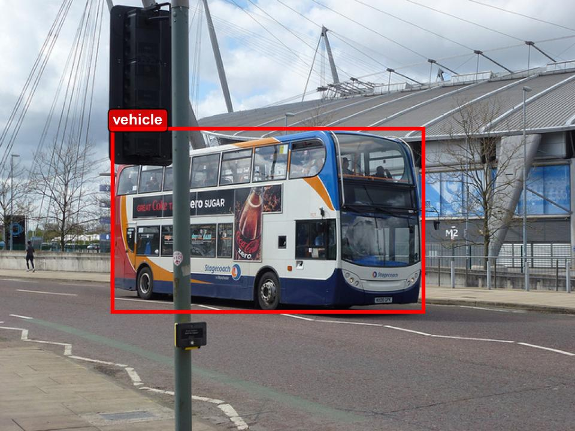
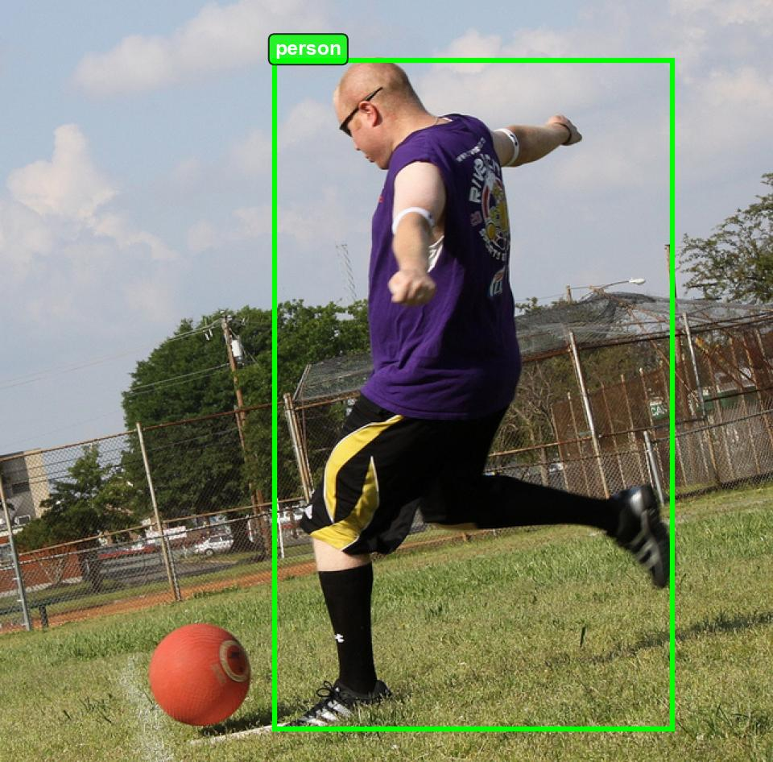
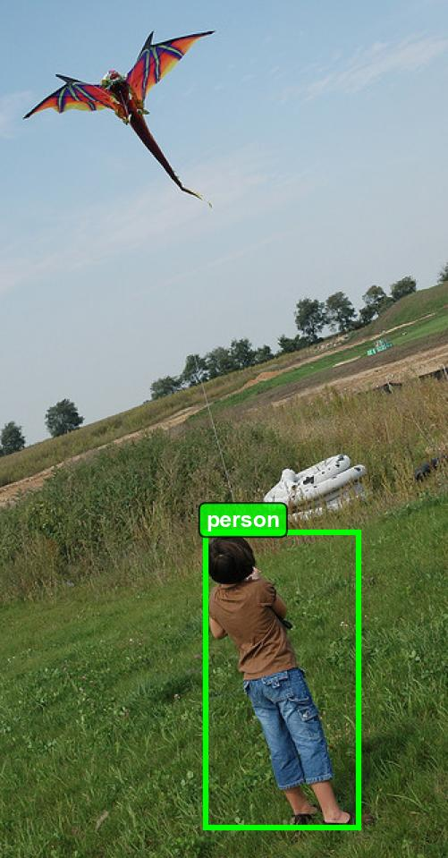
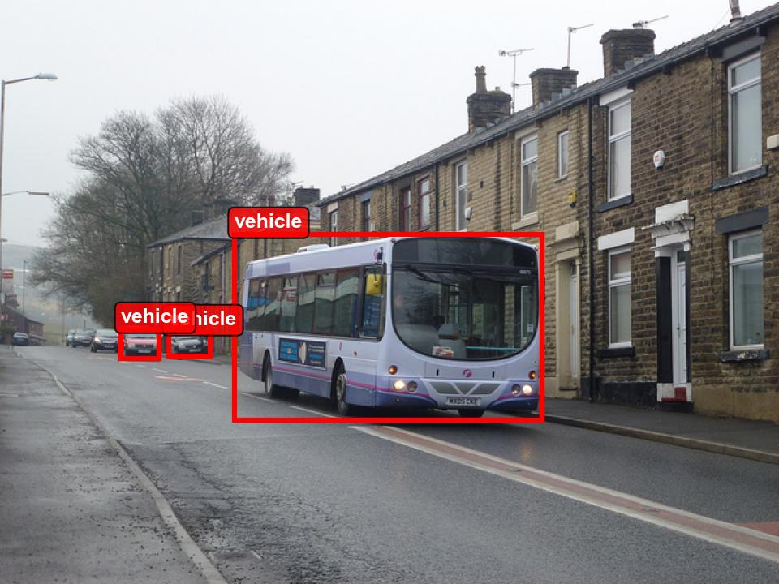
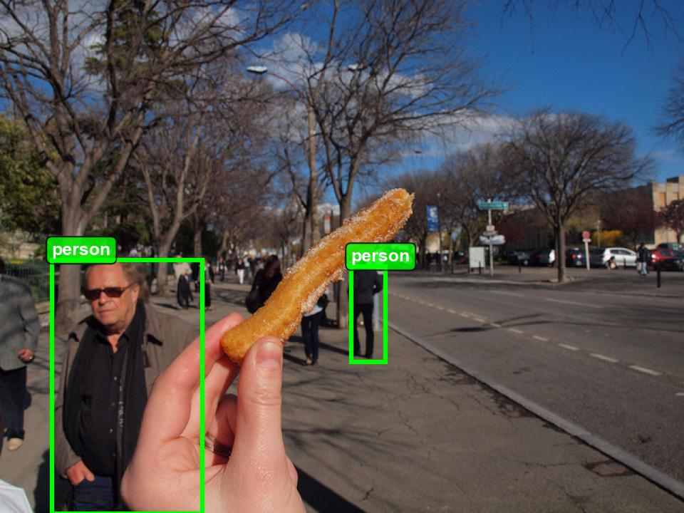
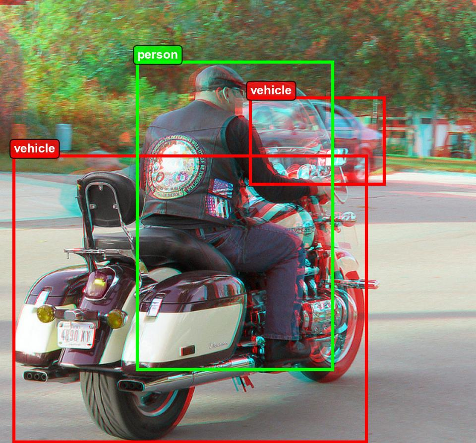
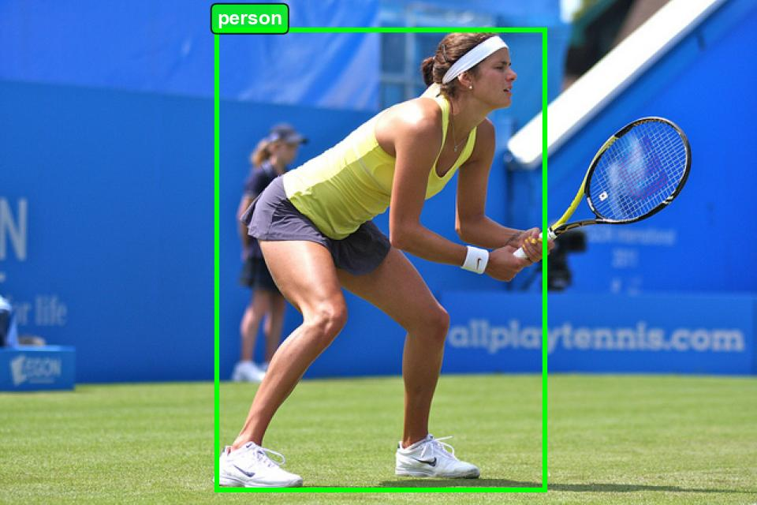

# YOLO Person & Vehicle Detection Dataset

<p align="center">
  
  
  
</p>

<p align="center">
  <em>Sample annotated images showing person (green) and vehicle (red) detection</em>
</p>

---

## � Project Overview

This project presents a **YOLO-compatible object detection dataset** created by manually annotating images containing **persons and vehicles**.  
The goal was to convert a raw image dataset into a **clean, validated, and production-ready dataset** suitable for training modern YOLO models (v5–v11).

> ⚠️ Due to GitHub size limits, only a **sample subset (30 images)** is included here.  
> The **full dataset** is available on [Kaggle](#-dataset-source).

---

## 📋 Table of Contents

1. [Project Overview](#-project-overview)
2. [Problem Statement](#-problem-statement)
3. [Dataset Source](#-dataset-source)
3. [Solution Approach](#-solution-approach)
4. [Dataset Overview](#-dataset-overview)
5. [Class Definitions](#-class-definitions)
6. [Annotation Rules](#-annotation-rules)
7. [Dataset Structure](#-dataset-structure)
8. [Annotation Format](#-annotation-format)
10. [YOLO Configuration](#%EF%B8%8F-yolo-configuration)
11. [Validation & Quality Checks](#-validation--quality-checks)
12. [Data Inspection & Visualization](#-data-inspection--visualization)
13. [Challenges Faced](#-challenges-faced)
14. [Results & Statistics](#-results--statistics)
15. [Tools & Technologies](#%EF%B8%8F-tools--technologies)
16. [How to Use](#-how-to-use)
17. [Use Cases](#-use-cases)
18. [Limitations](#%EF%B8%8F-limitations)
19. [Data Source Disclaimer](#%EF%B8%8F-data-source-disclaimer)
20. [Author](#-author)
21. [Acknowledgements](#-acknowledgements)

---

## 🎯 Problem Statement

Many publicly available image datasets are designed for **image classification** or **captioning tasks** but lack the **bounding box annotations** required for **object detection**. This creates a significant gap for researchers and practitioners who need ready-to-use detection datasets.

**Key Issues Identified:**
- Raw image datasets without localization annotations
- Inconsistent labeling standards across available datasets
- Lack of YOLO-compatible formatting
- Missing validation and quality assurance

**Objective:** Transform a raw image dataset into a **clean, validated, and production-ready YOLO dataset** for person and vehicle detection.

---

## 📦 Dataset Source

This dataset was curated and annotated from a publicly available Kaggle dataset:

| Attribute | Details |
|-----------|---------|
| **Source** | [Image Data (Object Detection and Captioning)](https://www.kaggle.com/datasets/aruneshhh/object-detection-images) |
| **Author** | ARUNESH |
| **License** | MIT License |
| **Original Size** | 15,000 images (2.45 GB) |
| **Original Split** | 70% Training / 30% Testing |

### What Was Done

> ✅ **Curated and annotated a representative subset of the source dataset**

From the original 15,000 images, a carefully selected subset of **2,000 images** was chosen based on:
- Presence of persons and/or vehicles
- Image quality and clarity
- Diversity of scenes (urban, rural, indoor, outdoor)
- Varying object sizes and occlusion levels

Each selected image was **manually annotated** with precise bounding boxes using standardized annotation rules.

---

## 💡 Solution Approach

```
┌─────────────────┐     ┌─────────────────┐     ┌─────────────────┐
│  Raw Images     │────▶│  Manual         │────▶│  YOLO-Ready     │
│  (No Labels)    │     │  Annotation     │     │  Dataset        │
└─────────────────┘     └─────────────────┘     └─────────────────┘
                               │
                               ▼
                        ┌─────────────────┐
                        │  Validation &   │
                        │  Quality Check  │
                        └─────────────────┘
```

**Workflow:**
1. **Image Selection** — Filter relevant images containing target classes
2. **Manual Annotation** — Draw precise bounding boxes using LabelImg
3. **Quality Review** — Verify annotation accuracy and consistency
4. **Format Conversion** — Ensure YOLO-compatible normalized coordinates
5. **Dataset Split** — Organize into train/validation sets (80/20)
6. **Validation** — Run automated checks for data integrity

---

## 📊 Dataset Overview

| Metric | Value |
|--------|-------|
| **Total Images** | 2,000 |
| **Total Annotations** | 4,041 |
| **Number of Classes** | 2 |
| **Training Images** | 1,600 (80%) |
| **Validation Images** | 400 (20%) |
| **Training Annotations** | 3,250 |
| **Validation Annotations** | 791 |
| **Annotation Format** | YOLO (normalized) |
| **Image Format** | JPG |

---

## 🏷️ Class Definitions

| Class ID | Class Name | Description |
|----------|------------|-------------|
| `0` | **person** | Any human being visible in the image |
| `1` | **vehicle** | Any mode of transportation (except bicycles and boats) |

---

## 📏 Annotation Rules

### Person Class (ID: 0)
Includes **any human being** visible in the image:
- ✅ Full body visible
- ✅ Partial body (upper/lower half)
- ✅ People in various poses (standing, sitting, walking, running)
- ✅ People of all ages (adults, children, elderly)
- ✅ Crowds (each visible person annotated separately)
- ❌ Extremely occluded persons (less than 20% visible)
- ❌ Mannequins, statues, or drawings

### Vehicle Class (ID: 1)
Includes **any mode of transportation**:
- ✅ **Cars** — Sedans, SUVs, hatchbacks, sports cars
- ✅ **Motorcycles & Bikes** — Motorbikes, scooters
- ✅ **Trucks** — Pickup trucks, delivery trucks, semi-trucks
- ✅ **Buses** — City buses, school buses, coaches
- ✅ **Trains** — Locomotives, train cars
- ✅ **Airplanes** — Commercial, private aircraft
- ✅ **Boats** — Ships, boats (when visible)
- ❌ Boats
- ❌ Bicycles
- ❌ Toy vehicles
- ❌ Vehicles in advertisements/posters
- ❌ Extremely small or unrecognizable vehicles

### General Annotation Guidelines
- **Tight bounding boxes** — Minimize background inclusion
- **Include partial objects** — If at least 20% is visible
- **Separate overlapping objects** — Each object gets its own box
- **Consistent labeling** — Same object type = same class ID

---

## 📂 Dataset Structure

```
yolo-person-vehicle-dataset/
│
├── 📄 README.md                    # Project documentation
├── 📄 LICENSE                      # License information
├── 📄 data.yaml                    # YOLO configuration file
│
├── 📁 dataset/                     # ⚠️ Available on Kaggle only
│   ├── 📄 classes.txt              # Class names
│   ├── 📁 images/
│   │   ├── 📁 train/               # 1,600 training images
│   │   └── 📁 val/                 # 400 validation images
│   └── 📁 labels/
│       ├── 📁 train/               # 1,600 training labels
│       └── 📁 val/                 # 400 validation labels
│
├── 📁 dataset_sample/              # Sample subset (30 images)
│   ├── 📁 images/                  # Original sample images
│   ├── 📁 labels/                  # Sample label files
│   └── 📁 annotated/               # Visualized annotations
│
└── 📁 notebooks/
    └── 📓 data_inspection.ipynb    # Data exploration notebook
```

> ⚠️ **Note:** The full `dataset/` folder is **NOT included on GitHub** due to size limitations.  
> Download the complete dataset from **[Kaggle](#-dataset-source)**.

---

## 📄 Annotation Format

Each image has a corresponding `.txt` file with the same name. Each line represents one object:

```
<class_id> <x_center> <y_center> <width> <height>
```

| Parameter | Description | Range |
|-----------|-------------|-------|
| `class_id` | Class index (0 or 1) | Integer |
| `x_center` | Normalized X center of bounding box | 0.0 – 1.0 |
| `y_center` | Normalized Y center of bounding box | 0.0 – 1.0 |
| `width` | Normalized width of bounding box | 0.0 – 1.0 |
| `height` | Normalized height of bounding box | 0.0 – 1.0 |

**Example Label File (`000000026154.txt`):**
```
0 0.257000 0.552553 0.066000 0.348348
1 0.577000 0.564565 0.602000 0.540541
```

This indicates:
- **Line 1:** Person at normalized position (0.257, 0.553) with size (0.066 × 0.348)
- **Line 2:** Vehicle at normalized position (0.577, 0.565) with size (0.602 × 0.541)

---

## ⚙️ YOLO Configuration

The dataset includes a `data.yaml` configuration file ready for training:

```yaml
path: dataset
train: images/train
val: images/val

names:
  0: person
  1: vehicle
```

**Compatible YOLO Versions:**
- ✅ YOLOv5
- ✅ YOLOv8
- ✅ YOLOv9
- ✅ YOLOv10
- ✅ YOLOv11

---

## ✅ Validation & Quality Checks

The dataset underwent rigorous validation:

| Check | Status | Description |
|-------|--------|-------------|
| **Image-Label Pairing** | ✅ Pass | Every image has a corresponding label file |
| **Coordinate Range** | ✅ Pass | All values within [0, 1] range |
| **Class ID Validity** | ✅ Pass | Only valid class IDs (0, 1) present |
| **Empty Labels** | ✅ Pass | No empty label files |
| **Duplicate Detection** | ✅ Pass | No duplicate annotations |
| **Bounding Box Size** | ✅ Pass | No abnormally small boxes (< 0.01% area) |

### Automated Validation Script
The `notebooks/data_inspection.ipynb` notebook includes:
- Dataset structure verification
- Class distribution analysis
- Bounding box statistics
- Sample visualization
- Annotation quality metrics

---

## � Data Inspection & Visualization

A Jupyter notebook (`notebooks/data_inspection.ipynb`) is provided to:

- 📊 Inspect dataset structure and file counts
- 📈 Analyze class distribution and balance
- 📐 Compute bounding box statistics (size, aspect ratio, position)
- 🖼️ Visualize annotated bounding boxes on sample images
- ✅ Validate annotation quality and format
- 📁 Generate sample subsets with annotated previews

**Run the notebook:**
```bash
cd notebooks
jupyter notebook data_inspection.ipynb
```

---

## �🚧 Challenges Faced

| Challenge | Description | Solution |
|-----------|-------------|----------|
| **Scale Variation** | Objects range from very small to very large | Careful annotation of all visible objects regardless of size |
| **Occlusion** | Partially hidden objects | Annotate if ≥20% visible, using visible portion bounds |
| **Crowded Scenes** | Multiple overlapping objects | Separate bounding box for each distinguishable object |
| **Ambiguous Cases** | Distant/blurry objects | Conservative approach — annotate only clearly identifiable objects |
| **Class Boundary** | Distinguishing vehicle types | Unified "vehicle" class for all transportation modes |
| **Annotation Fatigue** | 2,000 images manually annotated | Batch processing with regular quality checks |

---

## 📈 Results & Statistics

### Class Distribution

| Class | Training | Validation | Total | Percentage |
|-------|----------|------------|-------|------------|
| Person | ~1,800 | ~440 | ~2,240 | 55.4% |
| Vehicle | ~1,450 | ~351 | ~1,801 | 44.6% |
| **Total** | **3,250** | **791** | **4,041** | **100%** |

### Bounding Box Statistics

| Metric | Person | Vehicle |
|--------|--------|---------|
| Avg. Width (normalized) | 0.08 | 0.25 |
| Avg. Height (normalized) | 0.22 | 0.18 |
| Avg. Area (normalized) | 0.02 | 0.05 |
| Avg. Aspect Ratio (W/H) | 0.36 | 1.39 |

### Sample Annotated Images

<p align="center">
  
  
</p>

<p align="center">
  
  
</p>

---

## 🛠️ Tools & Technologies

| Tool | Purpose | Version |
|------|---------|---------|
| **[LabelImg](https://github.com/HumanSignal/labelImg)** | Image annotation tool | Latest |
| **Python** | Data processing & validation | 3.10+ |
| **Jupyter Notebook** | Interactive analysis | 7.0+ |

### Why LabelImg?
- ✅ Open-source and free
- ✅ Native YOLO format export
- ✅ Simple and intuitive interface
- ✅ Keyboard shortcuts for fast annotation
- ✅ Cross-platform compatibility

---

## 🚀 How to Use

### 1. Clone the Repository
```bash
git clone https://github.com/yourusername/yolo-person-vehicle-dataset.git
cd yolo-person-vehicle-dataset
```

### 2. Download Full Dataset
Download the complete dataset from Kaggle and extract to the `dataset/` folder:
- 📥 **[Download from Kaggle](https://www.kaggle.com/datasets/yourusername/yolo-person-vehicle-dataset)**

### 3. Verify Dataset Structure
```bash
python -c "from pathlib import Path; print('Dataset ready!' if (Path('dataset/images/train').exists()) else 'Please download dataset')"
```

### 4. Train with YOLOv8
```python
from ultralytics import YOLO

# Load a model
model = YOLO('yolov8n.pt')

# Train the model
results = model.train(
    data='data.yaml',
    epochs=100,
    imgsz=640,
    batch=16
)
```

### 5. Train with YOLOv5
```bash
python train.py --data data.yaml --weights yolov5s.pt --epochs 100 --img 640
```

### Compatible YOLO Versions
- ✅ YOLOv5
- ✅ YOLOv8
- ✅ YOLOv9
- ✅ YOLOv10
- ✅ YOLOv11

---

## 💼 Use Cases

This dataset is ideal for:

| Use Case | Description |
|----------|-------------|
| **🎓 Education** | Learning object detection concepts and YOLO training |
| **🔬 Research** | Computer vision research and experimentation |
| **🧪 Model Training** | Training and fine-tuning YOLO models |
| **📊 Benchmarking** | Comparing detection model performance |
| **💼 Portfolio Projects** | Demonstrating annotation and ML pipeline skills |
| **🏭 Production Pipelines** | Starting point for surveillance/monitoring systems |
| **📝 Annotation Demos** | Showcasing dataset preparation workflows |

---

## ⚠️ Limitations

| Limitation | Description |
|------------|-------------|
| **Dataset Size** | 2,000 images may not be sufficient for production-grade models |
| **Class Granularity** | Vehicles are not sub-classified (car, truck, bike, etc.) |
| **Domain Bias** | Images may not cover all environmental conditions |
| **Annotation Subjectivity** | Some edge cases may have inconsistent annotations |
| **Single Annotator** | No inter-annotator agreement validation |
| **Static Images Only** | No video sequences or temporal data |

### Recommendations for Improvement
- Expand dataset to 10,000+ images
- Add sub-categories for vehicle types
- Include multiple annotators for consensus
- Add nighttime and adverse weather images

---

## ⚖️ Data Source Disclaimer

> **Important Notice**

The images used in this project were obtained from a publicly available Kaggle dataset:
- **Source:** [Image Data (Object Detection and Captioning)](https://www.kaggle.com/datasets/aruneshhh/object-detection-images)
- **Original Author:** ARUNESH
- **License:** MIT License

**This project is intended for educational and research purposes only.**

- All annotations were created independently by the project author
- Original image rights and credits belong to the respective content owners
- If you are a copyright holder and believe this content should not be published, please contact for removal

**Usage Terms:**
- ✅ Educational use
- ✅ Research purposes
- ✅ Model training and experimentation
- ⚠️ Commercial use — Please verify original dataset license terms

---

## 👤 Author

**Haseeb Uddin**  
*Freelance Data Analyst*

| Platform | Link |
|----------|------|
| 🐙 GitHub | [github.com/Haseeb-U](https://github.com/Haseeb-U) |
| 💼 LinkedIn | [linkedin.com/in/haseeb-uddin-q/](https://www.linkedin.com/in/haseeb-uddin-q/) |
| 📊 Kaggle | [kaggle.com/haseebhsb](https://www.kaggle.com/haseebhsb) |

---

## 🌟 Acknowledgements

- **[LabelImg](https://github.com/HumanSignal/labelImg)** — Annotation tool
- **[Ultralytics](https://ultralytics.com/)** — YOLO implementations
- **[ARUNESH](https://www.kaggle.com/aruneshhh)** — Original dataset author
- **[Kaggle](https://www.kaggle.com/)** — Dataset hosting platform

---

## 📜 License

This project is licensed under the **MIT License** — see the [LICENSE](LICENSE) file for details.

---

<p align="center">
  ⭐ If you find this dataset useful, please consider giving it a star! ⭐
</p>